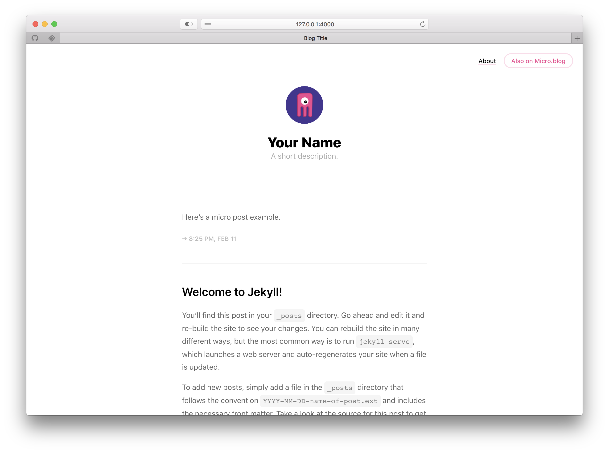

<<<<<<< HEAD
# _Marfa_ for Jekyll

#### Demo: [mmarfil.com/](http://mmarfil.com/)

## Screenshot

This Jekyll theme started as a port of [Cactus](https://github.com/eudicots/Cactus) to my own needs, but I ended up performing a lot more modifications than expected. Some people reached me out and asked if I could share it, so here we are.

#### Disclaimer: I'm only a designer, so please don't expect the code to be pretty.

## Usage
To start your project, [fork this respository](https://github.com/mmarfil/marfa/fork), put in your content, and go!
=======
# Information Blocks

This micro blog uses a slightly changed version of the Marfa for Jekyll theme. (Demo: mmarfil.com/) 

Feel free to use and adapt it yourself.
>>>>>>> 6f6d9a63d50a7a66a456320e6809db321daf567f

